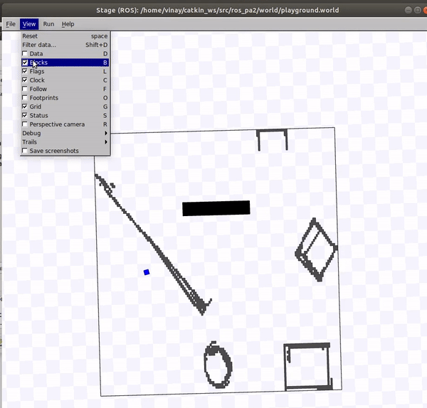

# A-Star-Path-Finding-and-Execution
The objective of this project to autonomously plan and execute a path for a robot in the Stage simulator from a start location to a goal location, given a map. The global plan is given by A* and the local planning is done using a modified Vector Field Histogram (mVFH). 

